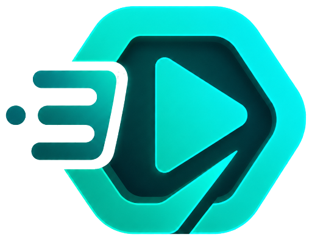

<p align="center">
  
</p>

<h1 align="center">streamXie UI</h1>

<p align="center">
  A cinematic React starter for building movie, series, anime, and streaming catalog websites.
</p>

<p align="center">
  <a href="https://github.com/Matsumiko/streamXie-ui"></a>
  
  
  
</p>

---

## Overview

`streamXie UI` is a frontend template for creators who want to ship a polished streaming-style website without starting from a blank screen. It includes a dark cinematic visual system, responsive catalog layouts, detail pages, watch page interactions, profile UI, mock auth screens, and local demo data.

This project is designed as a starter UI. It does not include a production backend, real video hosting, payments, DRM, or licensed media delivery.

## Highlights

- Cinematic home page with rotating hero banner and content rows.
- Browse page with category chips, filters, sorting, and responsive poster grid.
- Movie and series detail pages with cast, synopsis, seasons, episodes, and trailer modal.
- Watch page UI with custom video player controls, progress UI, recommendations, and episode list.
- My List and continue-watching flows backed by `localStorage`.
- Login, register, forgot password, reset password, profile, privacy, terms, cookies, and about pages.
- Responsive navigation with desktop dropdowns, mobile menu, command palette, and profile avatar state.
- Tailwind design tokens for brand color, surfaces, typography, radius, motion, and focus states.

## Tech Stack

| Area | Technology |
| --- | --- |
| App | React 18, TypeScript, Vite |
| Routing | React Router |
| Styling | Tailwind CSS, CSS custom properties |
| Components | Radix UI primitives, custom UI components |
| Motion | Framer Motion |
| Icons | Phosphor Icons, Lucide React |
| State/demo data | React state, `localStorage`, mock content data |

## Requirements

- Node.js 18 or newer. Node.js 20 LTS is recommended.
- npm 9 or newer.

## Installation

```bash
git clone https://github.com/Matsumiko/streamXie-ui.git
cd streamXie-ui
npm install
```

Start the development server:

```bash
npm run dev
```

Build for production:

```bash
npm run build
```

Preview the production build locally:

```bash
npm run preview
```

## Project Structure

```text
streamXie-ui/
|-- index.html                 - Vite HTML entry
|-- src/
|   |-- App.tsx                - Route registration and top-level app state
|   |-- index.tsx              - React entry point
|   |-- index.css              - Tailwind layers, tokens, global utilities
|   |-- assets/                - Brand, avatar, poster, and backdrop assets
|   |-- components/
|   |   |-- common/            - Brand, command palette, empty state, trailers
|   |   |-- content/           - Hero, carousel, poster, landscape, ranking cards
|   |   |-- details/           - Detail page sections
|   |   |-- layout/            - App shell, navbar, page container
|   |   |-- ui/                - Reusable Radix/Tailwind UI primitives
|   |   `-- watch/             - Video player surface
|   |-- data/mockContent.ts    - Demo catalog, genres, countries, filters
|   |-- hooks/                 - Auth, mobile, toast, document metadata hooks
|   |-- lib/                   - Brand constants, storage, utilities
|   `-- pages/                 - Route-level screens
|-- tailwind.config.js         - Tailwind theme extension
|-- vite.config.ts             - Vite and alias configuration
`-- FRONTEND-DNA.md            - Visual system rules for future UI work
```

## Available Routes

| Route | Purpose |
| --- | --- |
| `/` | Home and featured content |
| `/browse` | Catalog browsing, filters, category query params |
| `/movie/:slug` | Movie detail screen |
| `/series/:slug` | Series detail screen |
| `/watch/:id` | Watch/player screen |
| `/search` | Search screen |
| `/my-list` | Saved titles and continue watching |
| `/profile` | Profile and avatar preferences |
| `/genre/:name` | Genre collection screen |
| `/login`, `/register`, `/forgot-password`, `/reset-password` | Mock auth screens |
| `/privacy`, `/terms`, `/cookies`, `/about` | Static information pages |

## Customization Guide

### Brand

- Edit brand constants in `src/lib/brand.ts`.
- Replace the logo asset in `src/assets/streamxie-brand-logo.png`.
- Update page titles and metadata with `useDocumentMeta` calls in each page.

### Catalog Data

- Replace demo titles in `src/data/mockContent.ts`.
- Keep the `ContentItem` shape stable if you want existing cards, filters, detail pages, and player pages to keep working.
- For a real API, add a data layer first instead of importing directly from pages.

### Theme

- Edit color tokens, gradients, and typography in `src/index.css`.
- Keep Tailwind token names aligned with `tailwind.config.js`.
- Follow `FRONTEND-DNA.md` when adding or redesigning components.

### Routing

- Add route-level screens inside `src/pages`.
- Register routes in `src/App.tsx`.
- Add navigation links in `src/components/layout/Navbar.tsx` and footer links in `src/components/layout/AppLayout.tsx`.

### Persistence

Demo persistence lives in `localStorage` through `src/lib/storage.ts`, `src/lib/avatarStore.ts`, and `src/lib/storageKeys.ts`. Replace these with backend-backed services when adding real accounts.

## Deployment

`npm run build` creates a static app in `dist/`.

Common deployment options:

- Vercel: import the GitHub repo, use `npm run build`, output directory `dist`.
- Netlify: build command `npm run build`, publish directory `dist`.
- Static hosting/GitHub Pages: upload or publish the `dist` folder. The Vite config uses `base: "./"` to support relative asset paths.

## What Is Not Included

- Real authentication, sessions, roles, or account recovery.
- Backend API, database, admin panel, or CMS.
- Real video storage, transcoding, DRM, subtitles, or CDN delivery.
- Payment, subscription, billing, or license enforcement.
- Production content rights or media assets for commercial streaming.

## Public Release Checklist

- Choose and add a `LICENSE` file before inviting outside reuse.
- Add screenshots or a hosted demo link once deployment is ready.
- Decide whether this repo is a template app, a component library, or both.
- Add lint/typecheck/test scripts before accepting community contributions.
- Replace demo media with assets you own or assets explicitly licensed for reuse.

## Contributing

Contributions are welcome once the project is public. Keep changes focused, follow the current design system, and avoid adding backend assumptions to frontend-only components.

Recommended flow:

```bash
npm install
npm run dev
npm run build
```

## License

No license file is included yet. Until a license is added, reuse rights are not formally granted.
